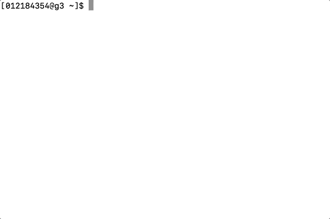

# cuda-zfnet

ZFNet implemented in CUDA C using pretrained weights extracted from Keras.

### Dependencies
- NVIDIA GPU

- Python utilities package dependencies: *keras, tensorflow, pillow, numpy*

Run `python get_rgb.py`  to get rgb value of image and extract to txt file, modify the image name and output file name in the get_rgb.py accordingly

Run `python get_weight_keras.py`  to get weightes and extract to txt files from pretrained model from Keras

### Usage

Run `make` to compile using *nvcc*

`./zfnet <input_file_path>`

Layer 6 7 8 weights data file exceed upload limit, full weights data file backup is available at https://drive.google.com/open?id=14TnQnLSAQ4YBpFP9tsnD9TEoMEIhIz4i
